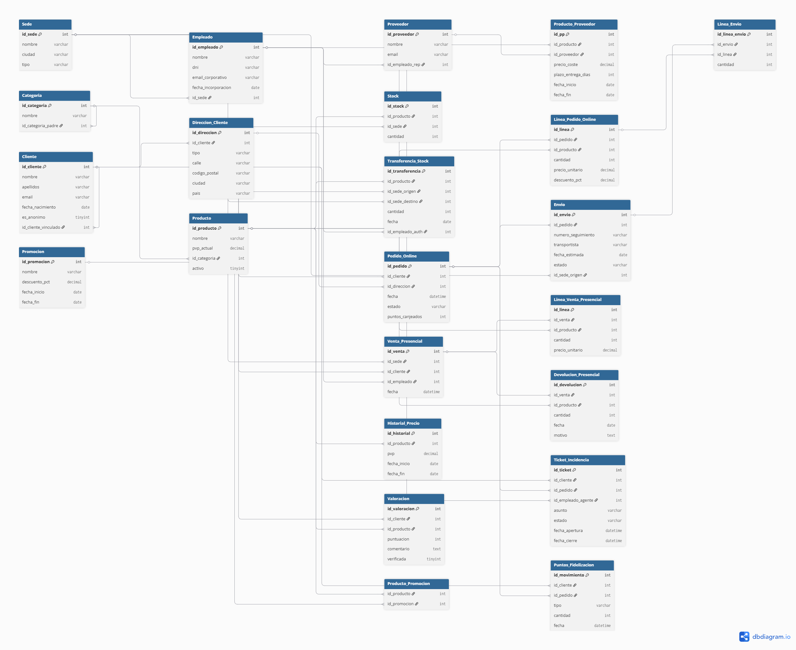

# NexShop Group S.A. — Base de Datos

**Alumno:** Javier Robles Ávila  
**Módulo:** Bases de Datos  
**Proyecto:** Mini Proyecto — Análisis, diseño e implementación desde cero

---

## Descripción del proyecto

NexShop Group S.A. es una empresa de distribución y venta al por menor con una tienda online (nexshop.es) y tres tiendas físicas en Valencia, Madrid y Barcelona. Este repositorio contiene el análisis, diseño e implementación completa de su base de datos relacional, incluyendo la gestión de clientes, pedidos online, ventas presenciales, stock, proveedores, promociones y programa de fidelización.

---

## Estructura del repositorio

```
mi-proyecto-nexshop/
│
├── README.md
├── docs/
│   ├── memoria.pdf           ← Análisis de entidades, atributos y preguntas de reflexión
│   ├── diagrama_er.png       ← Diagrama Entidad-Relación completo
│   └── modelo_relacional.pdf ← Modelo relacional con PKs y FKs
├── sql/
│   ├── schema.sql            ← CREATE TABLE con restricciones y FKs
│   └── datos.sql             ← INSERT con datos de prueba realistas
└── consultas/
    └── consultas.sql         ← 14 consultas SQL comentadas
```

---

## Cómo importar la base de datos

### Requisitos
- MySQL 8.0 o superior (o MariaDB 10.5+)
- MySQL Workbench o acceso a línea de comandos

### Pasos

1. Clona el repositorio:
```bash
git clone https://github.com/tu-usuario/mi-proyecto-nexshop.git
cd mi-proyecto-nexshop
```

2. Ejecuta el schema para crear la base de datos y las tablas:
```bash
mysql -u root -p < sql/schema.sql
```

3. Inserta los datos de prueba:
```bash
mysql -u root -p < sql/datos.sql
```

4. Ejecuta las consultas:
```bash
mysql -u root -p nexshop < consultas/consultas.sql
```

O bien abre cada archivo en MySQL Workbench, selecciona todo el contenido y pulsa el botón de ejecutar (⚡).

---

## Diagrama ER



---

## Decisiones de diseño destacadas

- **Clientes anónimos:** se modela con un flag `es_anonimo` en la tabla Cliente, permitiendo registrar ventas presenciales sin datos personales y vincularlas a una cuenta online posteriormente.
- **Pedidos con múltiples envíos:** la tabla `Envio` tiene FK a `Pedido_Online`, permitiendo N envíos por pedido.
- **Puntos de fidelización:** el saldo se calcula siempre desde el histórico de movimientos, sin campo de saldo redundante.
- **Histórico de precios y promociones:** tablas independientes `Historial_Precio` y `Promocion` para trazabilidad completa.
- **Categorías jerárquicas:** auto-referencia en `Categoria` para soportar categorías y subcategorías a cualquier nivel.
